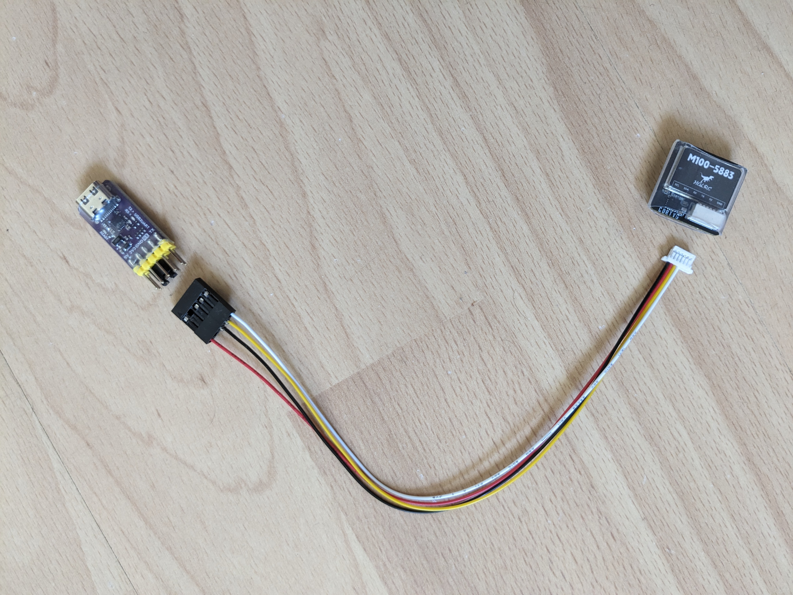

Python GPS
==========

I wanted to be able to read my location in Python using a cheap lightweight GPS module (targeted at the DIY drone market) connected to my laptop.

I used a [HGLRC M100-5883 GPS](https://www.hglrc.com/products/m100-5883-gps) module that costs less than US$20  (I actually purchased mine for less than US$14, including shipping to Switzerland, [here](https://www.aliexpress.com/item/1005005789393676.html) on AliExpress).

I also needed a UART-to-USB converter to be able to connect it to my laptop - I used a WeAct Studio CH343P [UART-to-USB converter](https://www.aliexpress.com/item/1005004399796277.html) (US$2 plus US$2 shipping).

Another similar module, that I'd recommend, is the Adafruit CP2102N [UART-to-USB converter](https://www.adafruit.com/product/5335) but at US$6 (not including shipping), it's noticeably more expensive and, unlike the WeAct module, you have to solder on the header connector yourself.

Cable
-----

I cut off one end of the 6-pin JST-SH connector that came with the GPS module, crimped on some female pins and popped them into a 5-pin Dupont connector shell as shown here:



The 5V and GND on the GPS module go to the 5V and GND pins of the UART-to-USB converter and the RX and TX go to the TX and RX pins respectively, i.e. you swap them over from one side to the other.

I removed the two right-most wires from the GPS module's connector - you do this by gently lifting the little plastic tab on the connector that holds each wire in place and easing out the wire. The GPS module also has a compass and these right-most wires provide an SPI interface to this compass. As we're only interested in GPS location and not in compass orientation, we don't need these wires.

If you don't have a crimping tool, just cut four [female jumper wires](https://www.adafruit.com/product/1951) in half, strip the ends and solder them to the wires of the GPS module's cable.

**Important:** make sure you cut off the right end of the GPS module's cable - initially, I didn't notice that the order of the wires is reversed between the two ends. One end is meant to be plugged into the GPS unit and the other into something else (typically, a drone flight controller but, in our case, the UART-to-USB converter).

If you look carefully at the connector, it has a flat plain side (that we'll call the back) and a side where tabs on the connector hold in place metal tabs on the female pins at the ends of the individual wires.

So, with the front facing you, you want to keep the end of the cable which has the ground (black) wire at the far left - cut off and discard the other end. When you insert the connector, into the GPS module, you'll flip it over (so that the black pin is furthest right and lines up with the pin order you can see printed below the HGLRC logo, i.e. _SCL SDA RX TX 5V GND_).

Connecting things up
--------------------

Once the cable for the GPS module is ready, plug the JST-SH end into the GPS module and the Dupont connector into the UART-to-USB converter, and use a normal USB cable to connect the converter to your laptop or PC.


The yellow power LED on the UART-to-USB converter should light up and its green LED should start blinking (indicating that it's receiving data from the GPS module).

The red power LED and the blue position LED on the GPS module should light up. The blue LED will stay lit if you're indoors but if you're outdoors, or you rest the module on a window sill, it will eventually start blinking to indicate that the GPS has acquired its position.

Note: the first time you power up such a module, it can take several minutes to acquire a position - this is because it first has to acquire the [almanac](https://en.wikipedia.org/wiki/GPS_signals#Almanac). If you plug the module in and out, it'll acquire a fix much quicker the second time as it'll use the almanac it acquired earlier. The almanac is only good for a limited amount of time and for a particular location. So, if you keep the unit powered off for some time or power it up in a very different location then it will need to reacquire the almanac.

Python software
---------------

To read data from the GPS module, I used the Python package [`pyubx2`](https://github.com/semuconsulting/pyubx2). But let's start easy and first use a simple command-line tool, that uses `pyubx2`, to just read data from the GPS module.

First create a Python virtual environment:

```
$ python3 -m venv venv
$ source venv/bin/activate
(venv) $ pip install --upgrade pip
```

Then install `pygnssutils`:

```
(venv) $ pip install pygnssutils
```

Then determine the serial device (on Mac or Linux) or the COM port on Windows that corresponds to the UART-to-USB converter.

On Mac, just do:

```
(venv) $ ls /dev/tty.usbmodem*
/dev/tty.usbmodem57350135541
```

On Linux, just do:

```
(venv) $ ls /dev/tty[AU]*
/dev/ttyACM0
```

On Windows, you'll have to use the _Device Manager_ as described [here](https://answers.microsoft.com/en-us/windows/forum/all/how-to-identify-com-ports-in-windows10/2591ed8b-805e-4e66-9513-836cdd49ed80), and you _may_ need to set the COM ports speed to 115200 (using the steps described [here](https://learn.adafruit.com/ftdi-friend/com-slash-serial-port-name)). Note: in general, working with serial ports is just a lot easier on Mac or Linux.

Once `pygnssutils` is installed, and you know your serial device name or COM port, just start the `gnssdump` utility with the baud rate set to 115200 (this is the default for most GPS modules intended for use with drones):

```
(venv) $ gnssdump --port /dev/tty.usbmodem57350135541 --baudrate 115200 --limit 16
2024-05-09 19:14:22.014711: Parsing GNSS data stream from: Serial<id=0x1028895d0, open=True>(port='/dev/tty.usbmodem57350135541', baudrate=115200, bytesize=8, parity='N', stopbits=1, timeout=3, xonxoff=False, rtscts=False, dsrdtr=False)...

<NMEA(GNGSA, opMode=A, navMode=3, svid_01=36, svid_02=, svid_03=, svid_04=, svid_05=, svid_06=, svid_07=, svid_08=, svid_09=, svid_10=, svid_11=, svid_12=, PDOP=1.87, HDOP=1.0, VDOP=1.59, systemId=3)>
<NMEA(GNGSA, opMode=A, navMode=3, svid_01=27, svid_02=29, svid_03=9, svid_04=32, svid_05=, svid_06=, svid_07=, svid_08=, svid_09=, svid_10=, svid_11=, svid_12=, PDOP=1.87, HDOP=1.0, VDOP=1.59, systemId=4)>
<NMEA(GNGSA, opMode=A, navMode=3, svid_01=, svid_02=, svid_03=, svid_04=, svid_05=, svid_06=, svid_07=, svid_08=, svid_09=, svid_10=, svid_11=, svid_12=, PDOP=1.87, HDOP=1.0, VDOP=1.59, systemId=5)>
...
```

The above command just parses and prints the first 16 messages it reads from the specified port.

If you print out more messages, you'll notice that you get a mix of UBX and NMEA messages (UBX is the proprietary protocol of [u-blox](https://en.wikipedia.org/wiki/U-blox) while [NMEA](https://en.wikipedia.org/wiki/NMEA_0183) is an open standard - however, u-blox devices are so prevalent that UBX is often the standard of choice).

If you want to see something a bit more human-consumable, you can capture the messages to a file, convert them to [GPX](https://en.wikipedia.org/wiki/GPS_Exchange_Format) and load them into a GPX viewer that can show the device's location on a map.

Before doing this make sure the blue position LED is blinking to indicate that it's acquired a position lock, then:

```
(venv) $ gnssdump --port /dev/tty.usbmodem57350135541 --baudrate 115200 --protfilter 2 --limit 32 --format 2 --outfile ubx-messages.bin
```

This just saves out the first 32 UBX messages in binary format to `ubx-messages.bin` (you can save out as many messages as you want, or leave it running with no limit, go on a walk with the module etc. and then kill `gnssdump` when done).

Next, you need to convert the UBX message to GPX. To do this, you can use the [`gpxtracker.py`](https://github.com/semuconsulting/pyubx2/blob/master/examples/gpxtracker.py) example application that's included in the [`pyubx2` repo](https://github.com/semuconsulting/pyubx2/).

On Windows, download `gpxtracker.py` using your browser. On Mac or Linux, you can just do:

```
(venv) $ curl -OL https://github.com/semuconsulting/pyubx2/raw/master/examples/gpxtracker.py
```

Then just run it like this (it asks you to enter the name of the file containing the saved UBX data):

```
(venv) $ python gpxtracker.py
UBX datalog to GPX file converter

Enter input UBX datalog file: ubx-messages.bin
Enter output directory: .

Processing file ubx-messages.bin...

32 NAV messages read from ubx-messages.bin
32 trackpoints written to ./gpxtrack-20240509192854.gpx

Operation Complete
```

Above, it shows that it output the GPX data to `gpxtrack-20240509192854.gpx`.

You can load this into any GPX viewer, e.g. go to [gpx.studio](https://gpx.studio/) and simply drag and drop the `.gpx` file onto the page, and it'll show you the GPS track.


My location is the checkered patten white dot above.

PyGPSClient
-----------

PyGPSClient is a full-blown application built on top of `pyubx2` (by the same people). It's powerful but it's a little idiosyncratic.

First, install it and run it:

```
(venv) $ pip install pygpsclient
(venv) $ pygpsclient
```

Note: `pygpsclient` requires a version of Python that supports [`tkinter`](https://docs.python.org/3/library/tkinter.html). If you're using the default `python3` that came with your Mac or Linux setup or have installed a version from the normal [Python download page](https://www.python.org/downloads/) then it will have this support. However, if you're using [`pyenv`](https://github.com/pyenv/pyenv) then the versions of Python that it installs may not include `tkinter` support - if `pygpsclient` fails to start and complains about missing `tkinter` support then follow these [steps](https://github.com/george-hawkins/snippets/blob/master/install-python.md#tkiniter).

Before you connect PyGPSClient to the GPS module, select the _View / Hide Console_ menu item - this hides the center panel that would otherwise show all the parsed messages received from the module. This may work at lower speeds, but I found that when receiving message at 115200 baud, displaying all the message overwhelmed the application and I had to kill it.

Chose the appropriate _Serial Port_, then, using the up and down buttons, increase the _Rate bps_ to 115200 and press the green _UBS/UART_ button to connect to the GPS module.


If you want, you can change the map type from _world_ to _sat_ or _map_ but for this you need a MapQuest API key (as described [here](https://github.com/semuconsulting/PyGPSClient/blob/master/README.md#mapquestapi)) - even though they have a large quota of 15,000 free lookups per month, MapQuest still require you register a credit card in order to get a key so that you can be billed if you go over quota. Because of this, I didn't try this feature.

When the GPS module is first starting up, one of the most important values to watch is the [PDOP](https://en.wikipedia.org/wiki/Dilution_of_precision_(navigation)) value, you'll see it start above 20 and then, as it gradually acquires satellites, fall to a value below 5 (assuming the module's view of the sky is not impeded by anything).

But once PDOP has reached a good value, I found it easier on the eye to collapse this panel (using the big arrow button at the upper-right) as the panel changes size slightly as the values in it change and this cause the whole UI to continuously adjust the size of the various panels.

PyGPSClient has no end of features, including the ability to configure the module, for all the details see its [`README`](https://github.com/semuconsulting/PyGPSClient/blob/master/README.md).

Coding
------

The whole point of all this was that I wanted to read GPS location data in my own Python program. Using the [`pyubx2`](https://github.com/semuconsulting/pyubx2) package, this turns out to be as simple as:

```
from serial import Serial
from pyubx2 import UBXReader
with Serial('/dev/tty.usbmodem57350135541', 115200, timeout=3) as stream:
  ubr = UBXReader(stream)
  raw_data, parsed_data = ubr.read()
  print(parsed_data)
```

This just prints out all GPS messages received from the module, to get location you just have to filter for the `NAV-PVT`, `NAV-POSLLH` and `NAV-HPPOSLLH` messages as shown [here](https://github.com/semuconsulting/pyubx2/blob/e40457a/examples/gpxtracker.py#L87).

Udev rules
---------

If you're using Linux and use the WeAct Studio CH343P UART-to-USB converter then these udev rules will make it easier to access:

```
# WCH CH343P
SUBSYSTEM=="tty", ATTRS{idVendor}=="1a86", ATTRS{idProduct}=="55d3", \
    SYMLINK+="ch343p-usb-serial", MODE="0660", TAG+="uaccess"

ATTRS{idVendor}=="1a86", ATTRS{idProduct}=="55d3", ENV{MTP_NO_PROBE}="1"
ATTRS{idVendor}=="1a86", ATTRS{idProduct}=="55d3", ENV{ID_MM_DEVICE_IGNORE}="1"
```

Just do:

```
$ sudo vim /etc/udev/rules.d/50-serial-ports.rules
```

And add the above udev rules - if you're new to udev rules then you'll be creating the file but if the file already exists then just add the rules at the end of the file.

These rules mean the device always shows up as `/dev/ch343p-usb-serial` and is accessible without any group or permissions magic.

See the Arch Linux wiki's [udev page](https://wiki.archlinux.org/title/udev) for more about udev.
